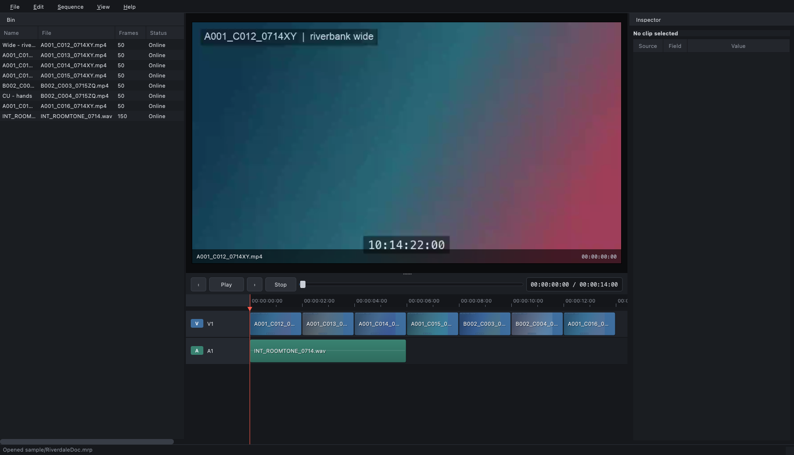
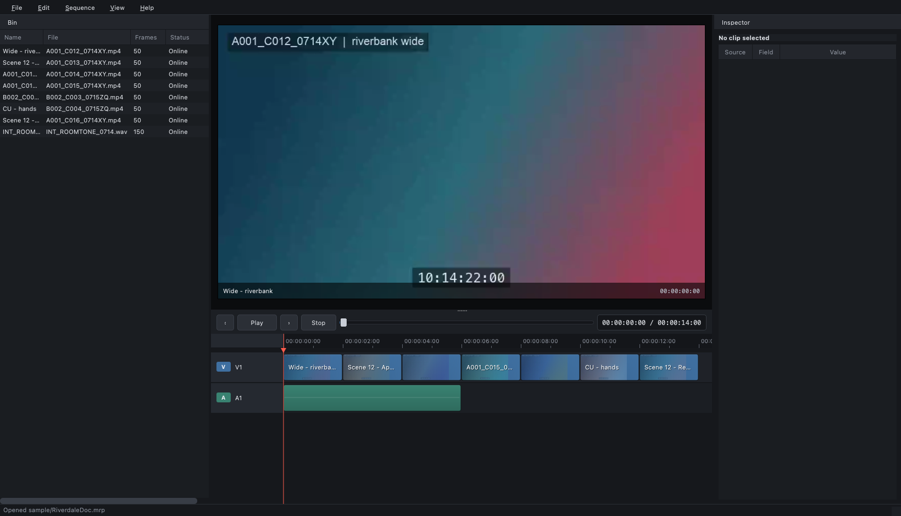

# MER-4417 — Clip filenames missing from timeline after 2026.12 upgrade

| | |
|---|---|
| **Reported by** | Support (relayed from customer) |
| **Customer** | Northbank Post, Cardiff — 3 seats, conform + QC |
| **Reported against** | 2026.12.0 |
| **Last known good** | 2026.4 |
| **Severity** | 2 — blocking a delivery workflow |
| **Component** | Timeline (assumed) |

## What the customer says

> Since the update our editors can't tell which file a clip on the timeline
> came from. In the old version the filename was printed right there on the
> clip in the timeline and that's how we do our conform QC — we read down the
> track and check each one against the delivery sheet.
>
> Now some clips show a name that isn't the filename, and some clips show
> nothing at all, just an empty blue box. The bin still looks normal as far as
> I can tell.
>
> We upgraded the workstations to the new OS at the same time so it could be
> that. One of the editors thinks the text is being squashed to zero width
> because it happens more on the 4K monitors, but I don't know.
>
> This is holding up our QC pass on two deliveries. Can we get the filenames
> back?

## Screens

Same project (`sample/RiverdaleDoc.mrp`), same media, two builds.

**2026.4 — what they had before the upgrade.** Every segment on V1 is
captioned with its source file name.

**2026.12 — what they have now.** Two segments on V1 carry no caption at all,
one still shows a file name, and the rest show something that is not the file
name. The Bin on the left is unchanged in both.

## Support notes

- Reproduced on the customer's project, and on our own sample project
  (`sample/RiverdaleDoc.mrp`) — so it is not their media or their storage.
- Customer's media is ingested with ReelFlow 3.2 before it reaches us.
- Customer has asked whether there is "a setting to turn the filenames back
  on". I couldn't find one that changes anything.
- Not reproduced on 2026.4 with the same project.

## Asks

1. Why did this change between 2026.4 and 2026.12?
2. Is the customer's workflow expected to keep working, or did we change it
   deliberately?
3. What do we tell them for the two deliveries they're sitting on?
